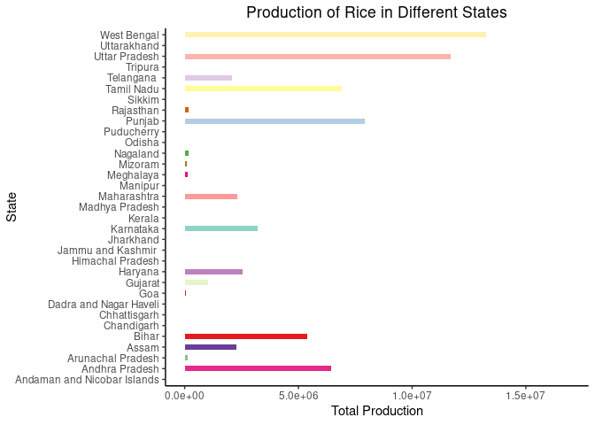
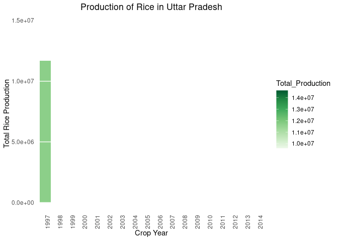

Crop Production Analysis
================

### **1. Loading libraries**

``` r
library(dplyr)
library(ggplot2)
library(gganimate)
library(RColorBrewer)
```

### **2. Loading Data**

``` r
crop_production <- read.csv("https://query.data.world/s/c7o6v7fgxuxutd6xjyj34e77psxoy3", header=TRUE, stringsAsFactors=FALSE)
str(crop_production)
```

    ## 'data.frame':    246091 obs. of  7 variables:
    ##  $ State_Name   : chr  "Andaman and Nicobar Islands" "Andaman and Nicobar Islands" "Andaman and Nicobar Islands" "Andaman and Nicobar Islands" ...
    ##  $ District_Name: chr  "NICOBARS" "NICOBARS" "NICOBARS" "NICOBARS" ...
    ##  $ Crop_Year    : int  2000 2000 2000 2000 2000 2000 2000 2000 2000 2000 ...
    ##  $ Season       : chr  "Kharif     " "Kharif     " "Kharif     " "Whole Year " ...
    ##  $ Crop         : chr  "Arecanut" "Other Kharif pulses" "Rice" "Banana" ...
    ##  $ Area         : num  1254 2 102 176 720 ...
    ##  $ Production   : num  2000 1 321 641 165 65100000 100 2 15 169 ...

### **3. Generating colors**

``` r
n <- 33
qual_col_pals = brewer.pal.info[brewer.pal.info$category == 'qual',]
col_vector = unlist(mapply(brewer.pal, qual_col_pals$maxcolors, rownames(qual_col_pals)))
```

### **4. Exploratory Data Analysis**

#### **4.1. Checking for missing values**

``` r
sapply(crop_production, function(x) sum(is.na(x)))
```

    ##    State_Name District_Name     Crop_Year        Season          Crop 
    ##             0             0             0             0             0 
    ##          Area    Production 
    ##             0          3730

#### **4.2. Calculating total production of “Rice” between 1997-2015**

``` r
total_rice_production <- crop_production %>% subset(Crop == "Rice") %>% group_by(Crop_Year) %>% 
                          summarise(Total_Production = sum(Production, na.rm = T)) %>% as.data.frame()
                          
rice_production_by_state <- crop_production %>% subset(Crop == "Rice") %>% group_by(Crop_Year, State_Name) %>% 
                                summarise(Total_Production = sum(Production, na.rm = T)) %>% as.data.frame()
```

##### **4.2.1. Plotting Year-wise production of rice in different states of india**

``` r
ggplot(rice_production_by_state, aes(State_Name,Total_Production,fill = State_Name)) + 
geom_bar(stat = "identity", width = 0.5) + theme_classic() + coord_flip() +
labs(title = 'Year: {frame_time}', x = 'State', y = 'Total Production') + transition_time(Crop_Year) + 
ggtitle("Production of Rice in Different States") + 
theme(legend.position = "none", plot.title = element_text(hjust = 0.5)) + 
scale_fill_manual(values = sample(col_vector, n))
```

<!-- -->

#### **4.3. Calculating “Rice” production in “Uttar Pradesh” in between 1997-2015**

``` r
rice_production_up <- crop_production %>% subset(Crop == "Rice" & State_Name == "Uttar Pradesh") %>%   
                      group_by(Crop_Year) %>% summarise(Total_Production = sum(Production, na.rm = T)) %>% as.data.frame()
```

##### **4.3.1. Plotting the Qunatity of “Rice” production in “Uttar Pradesh” between 1997-2015**

``` r
p <- ggplot(rice_production_up, aes(as.factor(Crop_Year), Total_Production, fill = Total_Production)) +
           geom_col() + scale_fill_distiller(palette = "Greens", direction = 1) + 
           ggtitle("Production of Rice in Uttar Pradesh") + labs(x="Crop Year",y="Total Rice Production") + 
           theme_minimal() +
           theme(
              panel.grid = element_blank(),
              panel.grid.major.y = element_line(color = "white"),
              panel.ontop = TRUE, plot.title = element_text(hjust = 0.5), 
              axis.text.x = element_text(angle=90))
    
p + transition_states(Crop_Year, wrap = FALSE) + shadow_mark()
```

<!-- -->
